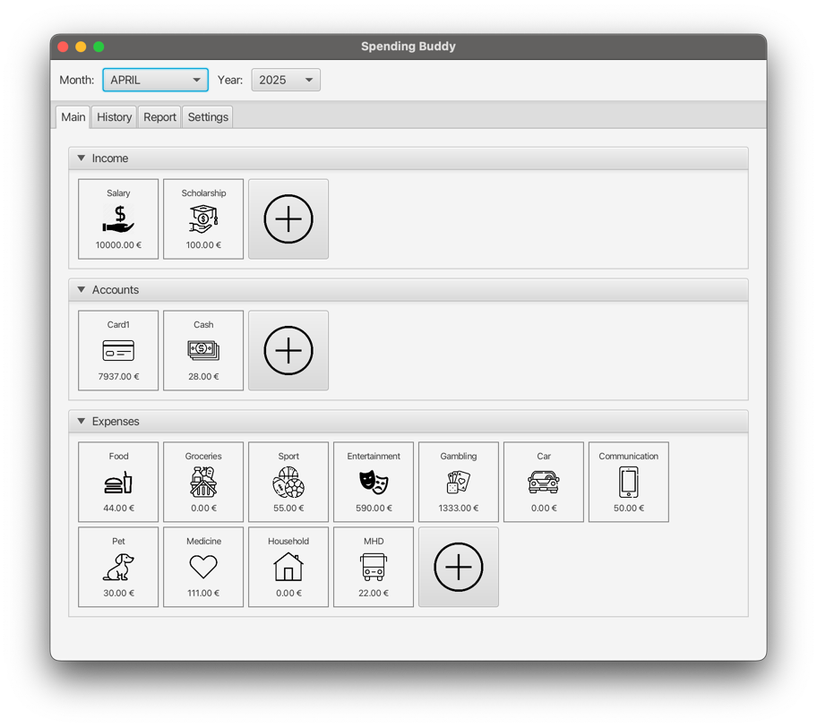
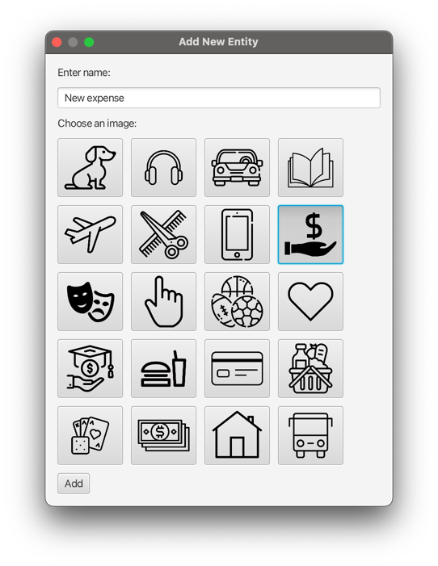
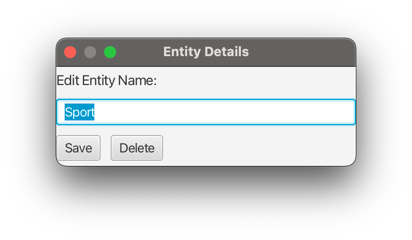
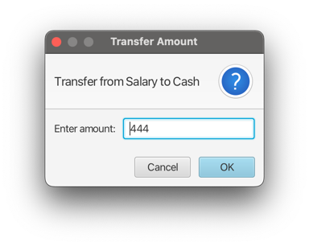
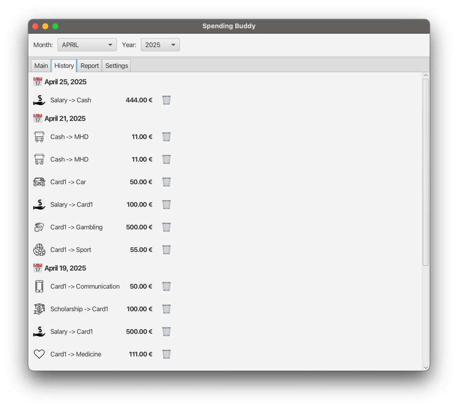
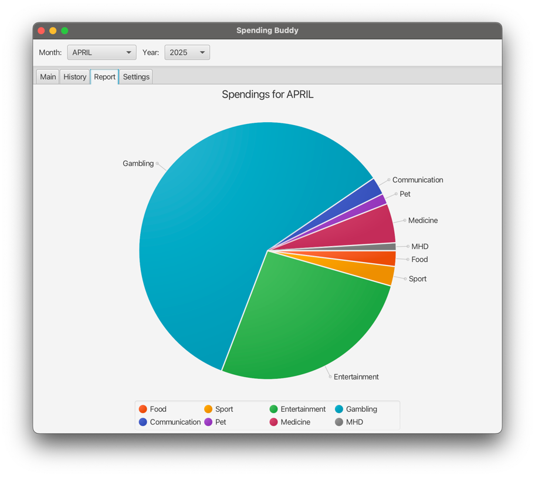

# Spending buddy

SpendingBuddy is a JavaFX application that helps users organize and monitor their personal finances.
With features like account tracking, income/expense categorization, and visual analytics,
it provides a user-friendly interface for better money management.

## Tabs

App contains four tabs:
1) Main tab: Has listed all entities, makes possible to do any operations
2) History tab: Contains a list of operations
3) Report tab: Contains a report fot current month
4) Settings tab: Selector for a currency and button to delete all the data

## Selecting a month

All stats that are visible are for the selected month. 
You can select it in the combobox on in the top panel

## Adding a new resource

It's possible to add three types of entities:
1) Income
2) Accounts
3) Expenses

To add a selected type, user need to click a **+** button, then select a name and an image

## Deleting

It's possible to delete all types of entities. But all operations related to this entity are going to be deleted too

To delete an entity you need to double-click on entity and click a delete button.

## Changing the name

To change a name you need to double-click on entity you want to modify, enter a new name and click a **Save** button.

## Operations

There are three types of operations in SpendingBuddy

1) Deposit money: Drag and drop selected source of income on a selected income and enter the value
2) Transfer money between accounts: Drag and drop source account on a target account and enter the value
3) Spend money: Drag and drop selected account on a type of expense and enter a value

## Cancelling the operation

### Cancelling the previous operation

To cancel the previous operation You are able to use **Ctrl+Z** combination. 
The history persists as long as app is not rebutted.

### Cancelling any operation

To cancel one of the operations, You can open a **History** tab, find the required operation and click a delete button.

## Looking into stats

To look into statistics for Your expenses during the month, You can open a **Report** tab
and take a look on a different categories of expenses.

